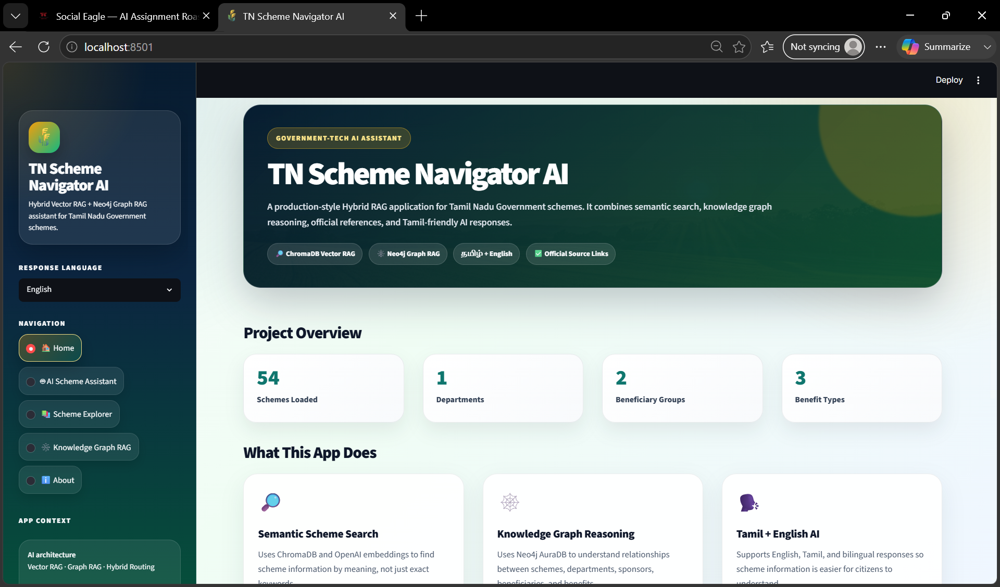
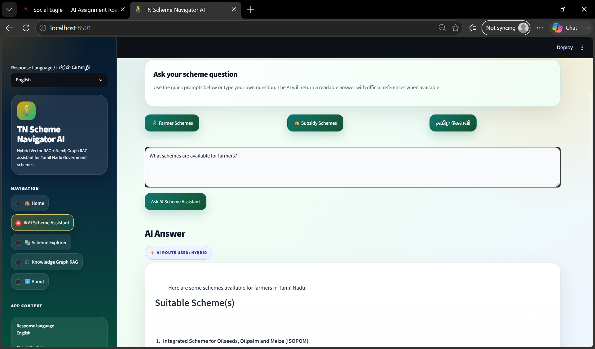
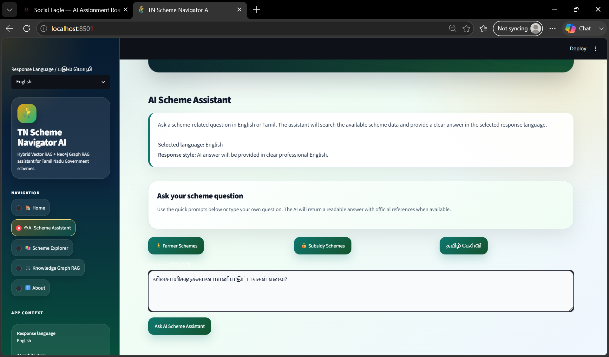

# TN Scheme Navigator AI  
## Tamil Nadu Government Scheme Assistant with Hybrid Graph RAG

TN Scheme Navigator AI is a Streamlit-based AI application that helps users search, understand, and verify Tamil Nadu Government scheme information.

The project combines:

- ChromaDB Vector RAG for semantic search
- NetworkX local graph fallback for relationship-based scheme discovery
- Optional Neo4j AuraDB Graph RAG for advanced knowledge graph querying
- OpenAI for final answer generation
- Tamil, English, and Bilingual response support

The app is designed for a citizen-friendly Tamil Nadu scheme discovery experience.

---

## Why This Project Matters

Government scheme information is often available online, but citizens may find it difficult to search, understand, and compare.

This project solves that by allowing users to ask simple questions such as:

```text
Which schemes are available for farmers?
```

```text
Which schemes are sponsored by State?
```

```text
விவசாயிகளுக்கான மானிய திட்டங்கள் எவை?
```

The app retrieves relevant scheme information and explains it in a simple format with official source references.

---

## Demo Screenshots

### Home Page



### Tamil Query Example



### English Response Example



---

## One Working Example Query

Run the app and ask this question in the **Knowledge Graph RAG** page:

```text
Which schemes are sponsored by State?
```

Expected style of output (real example pulled from `data/tn_scheme_details.csv`):

```text
Relevant schemes found:

1. Training to Farmers
   Department: Agriculture - Farmers Welfare Department
   Beneficiary: Farmers
   Benefit Type: Grants
   Sponsored By: State
   Source: https://www.tn.gov.in/scheme_details.php?id=MTU2Ng==

Note: Verify final eligibility and application process from the official source link.
```

Tamil example:

```text
விவசாயிகளுக்கான மானிய திட்டங்கள் எவை?
```

---

## Key Features

- Streamlit web application
- ChromaDB Vector RAG
- NetworkX local graph fallback
- Optional Neo4j AuraDB Knowledge Graph RAG
- Hybrid RAG engine
- Tamil / English / Bilingual response support
- Scheme Explorer with filters
- Official source references
- Production-style UI
- Route badge showing VECTOR / HYBRID / GRAPH flow
- Pytest-based test suite

---

## Technology Stack

| Area | Technology |
|---|---|
| Frontend | Streamlit |
| AI Orchestration | LangChain |
| LLM | OpenAI |
| Vector Database | ChromaDB |
| Embeddings | OpenAI Embeddings |
| Local Graph Fallback | NetworkX |
| Optional Knowledge Graph | Neo4j AuraDB |
| Graph Query | Cypher |
| Data Collection | Requests, BeautifulSoup |
| Data Handling | Pandas |
| Testing | Pytest |
| Environment Management | python-dotenv |
| Observability | LangSmith |

---

## Data Source

The project uses Tamil Nadu Government scheme data collected from the official scheme listing page.

```text
https://www.tn.gov.in/scheme_list.php?dep_id=Mg==
```

Current focus department:

```text
Agriculture - Farmers Welfare Department
```

### Data Freshness

`data/tn_scheme_details.csv` is committed to the repo as a snapshot so the app runs without
requiring a scrape on first clone. It is **not** auto-refreshed.

- Re-run `python scrape_schemes.py` whenever you need the latest scheme listings from the
  official site (the script overwrites the CSV in place).
- After re-scraping, re-run `python ingest.py` to rebuild the ChromaDB vector store, and
  `python scripts/load_graph_to_neo4j.py` if you are using Neo4j mode, since both are built
  from the CSV and will not pick up changes automatically.
- There is currently no scheduled re-scrape (cron, GitHub Action, etc.) — treat the committed
  CSV as "last known good" data, not live data, and verify dates/amounts against the official
  source link shown with each answer.

---

## Active AI Engine Flow

The Streamlit app uses this active engine flow:

```text
app.py
  ↓
run_hybrid_ai()
  ↓
hybrid_rag_engine.ask_hybrid_ai()
  ↓
├── rag_engine.ask_scheme_ai()
│     └── ChromaDB Vector RAG
│
└── graph_rag_engine.ask_graph_ai()
      ├── NetworkX local graph fallback
      └── Optional Neo4j AuraDB Graph RAG when USE_NEO4J=true
```

By default, the app runs with:

```text
ChromaDB Vector RAG + NetworkX Graph Fallback
```

Neo4j AuraDB is optional.

This makes the project easier to run locally without requiring live cloud graph infrastructure.

---

## Local Run Mode Without Neo4j

The project can run locally without Neo4j AuraDB.

In this mode:

- Vector RAG uses ChromaDB
- Graph-style relationship lookup uses NetworkX
- No live Neo4j database is required

Set this in `.env`:

```env
USE_NEO4J=false
```

Or leave `USE_NEO4J` unset. The app will use NetworkX fallback by default.

---

## Optional Neo4j Mode

To enable Neo4j AuraDB Graph RAG, add the following to `.env`:

```env
USE_NEO4J=true
NEO4J_URI=neo4j+s://your-aura-uri.databases.neo4j.io
NEO4J_USERNAME=neo4j
NEO4J_PASSWORD=your_neo4j_password_here
NEO4J_DATABASE=neo4j
```

Then run:

```cmd
python scripts/load_graph_to_neo4j.py
```

---

## Project Architecture

```text
Tamil Nadu Government Scheme Website
        ↓
scrape_schemes.py
        ↓
data/tn_scheme_details.csv
        ↓
        ├── ingest.py
        │       ↓
        │   ChromaDB Vector Database
        │
        ├── scripts/networkx_graph_preview.py
        │       ↓
        │   Local NetworkX Graph Preview
        │
        └── scripts/load_graph_to_neo4j.py
                ↓
            Optional Neo4j AuraDB Knowledge Graph

User Question
        ↓
Streamlit App
        ↓
Hybrid RAG Engine
        ↓
Vector RAG + NetworkX / Neo4j Graph RAG
        ↓
OpenAI Final Answer
        ↓
Citizen-friendly answer with source references
```

---

## How It Works

### 1. Data Collection

` scrape_schemes.py ` scrapes scheme information from the Tamil Nadu Government website.

Output:

```text
data/tn_scheme_details.csv
```

---

### 2. Vector RAG

` ingest.py ` converts scheme records into LangChain documents and stores embeddings in ChromaDB.

Used for meaning-based questions.

Example:

```text
What schemes are available for farmers?
```

---

### 3. NetworkX Graph Fallback

` graph_rag_engine.py ` builds a local NetworkX graph from the CSV file.

It creates graph-style relationships such as:

```text
Scheme → Department
Scheme → Beneficiary
Scheme → Benefit Type
Scheme → Sponsor
```

This allows the app to answer relationship-style questions even without Neo4j.

Example:

```text
Which schemes are sponsored by State?
```

---

### 4. Optional Neo4j Graph RAG

When `USE_NEO4J=true`, the app uses Neo4j AuraDB and Cypher-based Graph RAG.

This is useful for advanced graph querying and visual database exploration.

---

### 5. Hybrid RAG

` hybrid_rag_engine.py ` combines:

```text
Vector RAG answer
+
Graph RAG answer
+
OpenAI final response
```

The final response is generated in English, Tamil, or Bilingual format.

---

## Prompt Quality

The app uses explicit prompt instructions for language control and answer quality.

### Tamil Response Instruction

```text
Respond fully in Tamil.
Use simple, clear Tamil that a normal citizen can understand.
Keep government scheme names in English if exact translation may confuse the user.
Explain eligibility, benefit, how to apply, and source clearly.
```

### English Response Instruction

```text
Respond in clear professional English.
Keep the answer simple, structured, and citizen-friendly.
```

### Bilingual Response Instruction

```text
Respond in both English and Tamil.
First give a short English answer.
Then provide the Tamil explanation below it.
Keep the Tamil simple and citizen-friendly.
```

### Final Hybrid RAG Prompt Structure

```text
You are TN Scheme Navigator AI, an expert assistant for Tamil Nadu Government schemes.

Inputs:
- User question
- Selected response language
- Language instruction
- Routing decision
- Vector RAG answer
- Graph RAG answer
- Official source references

Rules:
1. Use only retrieved Vector RAG and Graph RAG information.
2. Do not invent scheme details.
3. If information is not available, say so clearly.
4. Mention scheme names clearly.
5. Explain beneficiaries, benefits, sponsor or department, and how to apply if available.
6. Keep the answer simple and citizen-friendly.
7. Ask the user to verify details from official source links.
```

---

## Streamlit Pages

### 1. Home

Shows:

- Project summary
- Architecture overview
- AI stack
- Key metrics

### 2. AI Scheme Assistant

Allows users to ask scheme-related questions.

Example buttons:

- Farmer Schemes
- Subsidy Schemes
- Tamil Question

### 3. Scheme Explorer

Allows users to explore the scraped scheme dataset.

Filters:

- Department
- Beneficiary
- Benefit Type
- Keyword search

### 4. Knowledge Graph RAG

Used for relationship-based questions.

Example buttons:

- State Sponsored Schemes
- Farmer Grant Schemes
- Seed Support Schemes
- Subsidy Schemes
- Soil Health Schemes
- Tamil Question

### 5. About

Explains:

- Project purpose
- Technology stack
- Safety disclaimer

---

## Folder Structure

```text
TN Scheme RAG/
│
├── app.py
├── scrape_schemes.py
├── ingest.py
├── rag_engine.py
├── graph_rag_engine.py
├── hybrid_rag_engine.py
├── language_utils.py
│
├── scripts/
│   ├── load_graph_to_neo4j.py
│   └── networkx_graph_preview.py
│
├── requirements.txt
├── requirements-dev.txt
├── pytest.ini
├── README.md
├── .gitignore
├── .env.example
├── .env
│
├── tests/
│   └── test_rag_system.py
│
├── docs/
│   ├── sample_questions.md
│   └── screenshots/
│       ├── 01-home-page.png
│       ├── 02-tamil-query.png
│       └── 03-english-response.png
│
├── data/
│   ├── tn_scheme_details.csv
│   └── knowledge_graph_preview.png
│
├── vector_db/
│
└── venv/
```

---

## Important Files

| File | Purpose |
|---|---|
| `app.py` | Main Streamlit frontend |
| `scrape_schemes.py` | Scrapes official scheme data |
| `ingest.py` | Creates ChromaDB vector database |
| `rag_engine.py` | Vector RAG engine |
| `graph_rag_engine.py` | NetworkX fallback and optional Neo4j Graph RAG |
| `hybrid_rag_engine.py` | Combines Vector RAG and Graph RAG |
| `language_utils.py` | Tamil, English, and Bilingual prompt helpers |
| `scripts/load_graph_to_neo4j.py` | Loads graph data into Neo4j AuraDB |
| `scripts/networkx_graph_preview.py` | Creates local graph preview |
| `tests/test_rag_system.py` | Consolidated pytest test suite |

---

## Environment Variables

Create `.env` in the project root.

Minimum local setup:

```env
OPENAI_API_KEY=your_openai_api_key_here
USE_NEO4J=false
```

Optional LangSmith:

```env
LANGSMITH_TRACING=true
LANGSMITH_API_KEY=your_langsmith_api_key_here
LANGSMITH_PROJECT=TN-Scheme-Navigator-AI
```

Optional Neo4j:

```env
USE_NEO4J=true
NEO4J_URI=neo4j+s://your-aura-uri.databases.neo4j.io
NEO4J_USERNAME=neo4j
NEO4J_PASSWORD=your_neo4j_password_here
NEO4J_DATABASE=neo4j
```

Do not push `.env` to GitHub.

---

## Setup Order at a Glance

Required, in order, for the app to run at all:

```text
1. pip install -r requirements.txt
2. copy .env.example .env   (fill in OPENAI_API_KEY)
3. python ingest.py          (builds vector_db/ from the committed CSV)
4. streamlit run app.py
```

`data/tn_scheme_details.csv` already ships in the repo, so step 3 works out of the box without
needing to scrape first. Everything below is optional and only needed if you want to refresh
the data or enable extra graph tooling:

```text
python scrape_schemes.py              # optional: refresh data/tn_scheme_details.csv
                                       # re-run ingest.py after this if you do
python scripts/networkx_graph_preview.py   # optional: generates data/knowledge_graph_preview.png
python scripts/load_graph_to_neo4j.py      # optional: only if USE_NEO4J=true
```

See [Data Freshness](#data-freshness) for why the CSV isn't auto-refreshed, and the two
sections below for the full NetworkX-only and Neo4j walkthroughs.

---

## Installation

### 1. Clone repository

```cmd
git clone https://github.com/VishnuAIHRschool/-TN-Scheme-Navigator-AI.git
```

### 2. Go to project folder

```cmd
cd "-TN-Scheme-Navigator-AI"
```

### 3. Create virtual environment

```cmd
python -m venv venv
```

### 4. Activate virtual environment

```cmd
venv\Scripts\activate
```

### 5. Install dependencies

```cmd
pip install -r requirements.txt
pip install -r requirements-dev.txt
```

---

## Run Locally Using NetworkX Fallback

This mode does not require Neo4j.

### Step 1: Create your `.env` from the template

```cmd
copy .env.example .env
```

Then edit `.env` and set at minimum:

```env
OPENAI_API_KEY=your_openai_api_key_here
USE_NEO4J=false
```

### Step 2: Scrape scheme data

```cmd
python scrape_schemes.py
```

### Step 3: Create vector database

```cmd
python ingest.py
```

### Step 4: Generate NetworkX preview

```cmd
python scripts/networkx_graph_preview.py
```

### Step 5: Run Streamlit app

```cmd
streamlit run app.py
```

### Step 6: Ask this working query

```text
Which schemes are sponsored by State?
```

---

## Run With Neo4j AuraDB Optional Mode

### Step 1: Add Neo4j credentials in `.env`

```env
USE_NEO4J=true
NEO4J_URI=neo4j+s://your-aura-uri.databases.neo4j.io
NEO4J_USERNAME=neo4j
NEO4J_PASSWORD=your_neo4j_password_here
NEO4J_DATABASE=neo4j
```

### Step 2: Load graph into Neo4j

```cmd
python scripts/load_graph_to_neo4j.py
```

### Step 3: Run app

```cmd
streamlit run app.py
```

---

## Testing

The old loose print-based test files were removed.

Current test structure:

```text
tests/
└── test_rag_system.py
```

Install test dependency:

```cmd
pip install -r requirements-dev.txt
```

Run tests:

```cmd
pytest
```

The test suite checks:

- CSV file availability
- Required CSV columns
- Language instruction availability
- UI text keys
- Hybrid router behavior
- Vector RAG import
- Graph RAG import
- Hybrid RAG import
- Optional Neo4j read-only connection when credentials are available

---

## Sample Questions

### English

```text
Which schemes are available for farmers?
```

```text
Which schemes provide subsidy benefits?
```

```text
Which schemes are sponsored by State?
```

```text
Which schemes are related to seed support?
```

```text
Which schemes are connected to soil health?
```

### Tamil

```text
விவசாயிகளுக்கான திட்டங்கள் எவை?
```

```text
விவசாயிகளுக்கான மானிய திட்டங்கள் எவை?
```

```text
மாநில அரசு நிதியுதவி வழங்கும் திட்டங்கள் எவை?
```

---

## Sample Output

```text
Relevant schemes found:

1. Scheme Name
   Department: Agriculture - Farmers Welfare Department
   Beneficiary: Farmers
   Benefit Type: Grants / Subsidy / Training
   Sponsored By: State
   Source: Official Tamil Nadu Government source

Please verify final eligibility, benefits, and application process from the official source link.
```

---

## Neo4j Browser Queries

Use only when Neo4j mode is enabled.

### View graph

```cypher
MATCH (n) RETURN n LIMIT 50;
```

### View relationships

```cypher
MATCH (s:Scheme)-[r]->(n)
RETURN s.name, type(r), n.name
LIMIT 50;
```

### State sponsored schemes

```cypher
MATCH (s:Scheme)-[:SPONSORED_BY]->(sp:Sponsor)
WHERE toLower(sp.name) CONTAINS "state"
RETURN s.name AS Scheme, sp.name AS Sponsored_By
LIMIT 25;
```

---

## Git Ignore

`.gitignore` should include:

```gitignore
venv/
.env
vector_db/
__pycache__/
*.pyc
*.pyo
*.pyd
.DS_Store
data/knowledge_graph_preview.png
```

---

## Responsible AI Disclaimer

This application is for learning, exploration, and citizen-friendly information discovery.

Users should always verify final eligibility, scheme benefits, and application process from the official Tamil Nadu Government source links.

This app should not be treated as the final legal, policy, or eligibility authority.

---

## Future Enhancements

- Add all Tamil Nadu departments
- Add district-level filtering
- Add eligibility checker
- Add Tamil voice input
- Add PDF export for scheme summaries
- Add graph visualization inside Streamlit
- Add deployment on Streamlit Cloud
- Add answer quality evaluation metrics
- Add user feedback collection

---

## Developed By

**Vishnukumar**  
Gen AI Architect Program  
Hybrid Graph RAG Project  
TN Scheme Navigator AI